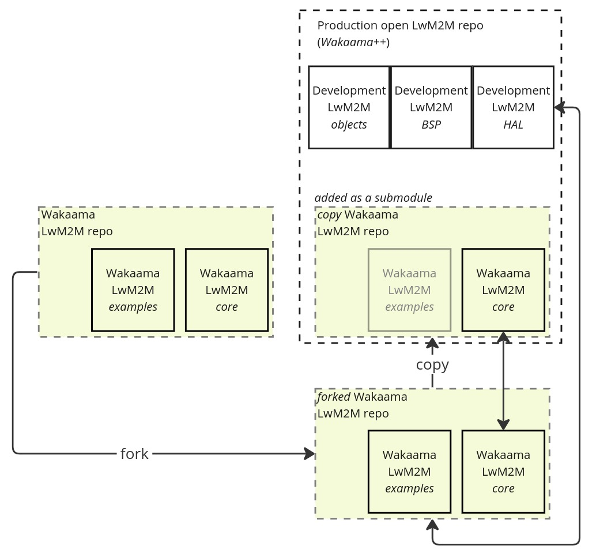
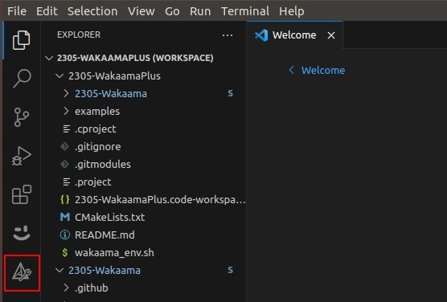
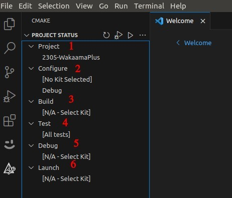
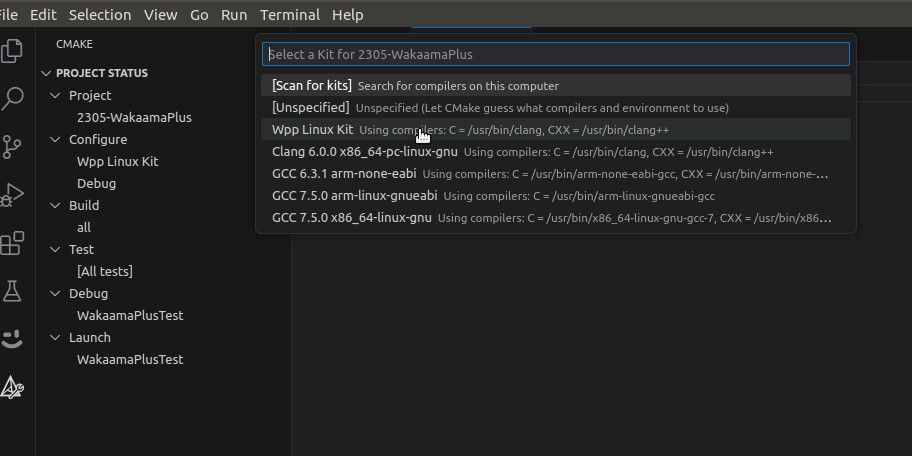

\page build_tag Build Instructions for WakaamaPlus


## Overview

This document provides detailed instructions on how to build the WakaamaPlus project. It covers requirements, setup steps, and common issues.


## Repos Structure

The current \[07.06.2023\] structure contains only 3 repos (other will be created on ad-hoc basis):

* _WakaamaPlus_ Main Development Repo: [https://github.com/sinai-io/2305-WakaamaPlus](https://github.com/sinai-io/2305-WakaamaPlus)
* _Wakaama Upstream_ repo [https://github.com/eclipse/wakaama](https://github.com/eclipse/wakaama)
* _Wakaama Copy_ \[as on 07.06.2023\]: [https://github.com/sinai-io/2305-Wakaama](https://github.com/sinai-io/2305-Wakaama)




## Environment Setup


### Automatic setup
The simpliest way is to use automatic setup by provided script - see [Automatic Setup](./../../wpp_env_setup.sh).

However this script is only helper and not heavy tested, so in case of problems, below you will find the full description of Environment Setup (skip the Automatic Setup chapter).


## Source code


### WakaamaPlus source code

Clone repository with submodules:
```
git clone --recurse-submodules git@github.com:sinai-io/2305-WakaamaPlus.git
```


### Wakaama source code

Clone [repository](https://github.com/eclipse/wakaama) with submodules: 
```
git clone --recurse-submodules git@github.com:eclipse/wakaama.git
```


## VS Code installation


### Environment

Visual Studio Code: 1.80.1 / **1.81.1**

Ubuntu: 18.04.6 / **22.04**


### Project setup stages

* Download [Visual Studio Code](https://code.visualstudio.com/download).
* Download the repository (`git clone --recurse-submodules git@github.com:sinai-io/2305-WakaamaPlus.git`).
* Go to the **2305-WakaamaPlus** folder.
* Run the `wpp_env_setup.sh` script to install the necessary utilities.
* Start **VSCode** and go to **File → Open Workspace from File**.
* In the opened window, specify the path to the file `vs-code-wakaamaplus.code-workspace` located in the **2305-WakaamaPlus** repository.
* After the workspace has loaded, go to **Extensions** `(Ctrl+Shift+x)`, set **Recommended** `(Text field: @recommended)` in the extensions filter, and then install all recommended extensions.


* Let’s move on to the **Cmake extension**, the open one contains the entire main interface of the CMake Tool extension.



* Before the first build of the projects, it is necessary to configure the Kit in both projects, for this you need to choose **Wpp Linux Kit** (but in general the compiler depends on the target platform) as a compiler for both projects. After the kit is installed, you can start the first building.

If you use Ubuntu with the 18 version and have trouble running `waakama_env.sh` - use the next commands and try again to run `waakama_env.sh`:
```
sudo apt-get install libstdc++-13-dev
sudo apt install clang-14
```

If you can not install **clang** or **clang-format** run the next commands:
```
wget https://apt.llvm.org/llvm.sh
chmod +x llvm.sh
sudo ./llvm.sh 14
sudo apt install clang-format-14
```


### Notes



**CMake Tool:** 1 - allows you to select oneof the projects in the workspace, 2 - allows you to select the tool kit (the compiler with which the project will be compiled) and the build variant (Release, Debug), 3 - allows you to set the target (all, or some specific variant), 4 - runs the existing tests, 5 - starts the debug for the selected file, 6 - starts the execution of the selected file.

If you need to add custom Kit or modify the list of available kits it can be done in file vs- code-cmake-kits.json, that describes available kits. Also when you select needed kit in VS code, in addition to Wpp Linux Kit you can see other available on the PC that can be selected, if you need you can use them.




### Problems&Solutions

#### Cmake Tool PROJECT STATUS is not displayed
> **Solution:** reload the CMake Tool extension.

#### Cmake Tools doesn't want to configure projects (no button for it)
> **Solution:** reinstall CMake and Cmake Tools extensions.


## Eclipse installation

Wakaama has CMake build system, so it can be developed using any appropriate IDE / text editor with further building using the command line.

However such approach is not very useful for active development, because lack of code completion and debug.

To make the development process smoother and faster we considered 2 IDE for further development: Eclipse IDE and Visual Studio Code.

After evaluation of both, we choose the Eclipse IDE due to it cross-platform nature and high flexibility. We also made a setup to build the Wakaama lib automatically in Eclipse.


### **Installing/setup/build WakaamaPlus ( with cmake4eclipse )**

* Download [installer](https://www.eclipse.org/downloads/packages/installer).
* Export from archive.
* `cd ./eclipse-installer`.
* Run `./eclipse-inst`.
* Select **C/C++ installation**.
* Install **cmake4eclipse** plugin.

`Help → Eclipce Marketplace...→search` `cmake4eclipse` `→ install`

* `File` → `Open Project from File System` → in `Import source` click `Directory...` → select repository folder `2305-WakaamaPlus` → `Finish`.
* In `Project Explorer` run `all` → after a successful build, a `_build` folder will be created containing the binary examples to run → go to the `_build/Debug/examples/client` and run `lwm2mclient`.


### **Build&Debug Wakaama ( with cmake4eclipse )**

(_if configuring an empty Wakaama repository in the IDE_)

* Install cmake4eclipse plugin.
`Help` → `Eclipce Marketplace...` → search **cmake4eclipse** → `install`.
* Create new project.
`File` → `New` → `Project...` → `C/C++` → `C/C++ Project` → `Cmake4eclipse Managed Build` → `Next/Finish`.
* Add files from repo and `build all`. Check result in folder `_build/Debug/`.
* For debug: `Debug Configuration` → `C/C++ Application` → `Search Project...` → select whitch you want → `Apply` → `Debug`.
